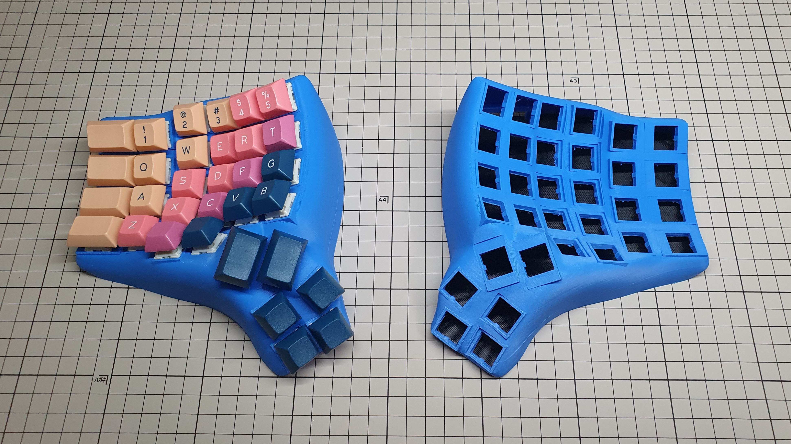

# Blended Dactyl-ManuForm Keyboard (Blended-DM)
This is a fork of the [Dactyl-ManuForm](https://github.com/tshort/dactyl-keyboard), which is itself a fork of the [Dactyl](https://github.com/adereth/dactyl-keyboard), a parameterized, split-hand, concave, columnar, ergonomic keyboard.

This project aims to rewrite the original codebase from Clojure to Python leveraging the `bpy` and `bmesh` libraries for [Blender](https://www.blender.org/).

## Disclaimer

This script is very much a work-in-progress. It is easy to select a set of parameters outside the "stable generation space".  Additionally, Blender's output is not always predictable in mesh-output or runtime length.  If a malformed object is generated, re-running the script (without any change to the codebase) *may* produce a better result. Your mileage may vary.

## Generating a Design

**Install Blender**
* [Install the Blender 2.93.x LTS Application](https://www.blender.org/download/lts/2-93/)

**Load Script**
* Open Blender and delete the start cube
* Switch to the Scripting Window
* Either Copy-Paste the code into a new file *or* load [src/blended-dm.py](src/blended-dm.py)
* *Optional:* Open Console Window to observe output
* *Optional:* Edit parameters near beginning of file as desired. Increasing `body_subsurf_level` will increase the body smoothness but drastically increase generation time.
* Run the scrpt by pressing the **PLAY** button
* If objectes generated correctly, export as .stl (located under File menu)

### Required Hardware for Case
* 2x6mm disc magnets ( 12 )
* CA glue
* A loligagger-style board holder, such as the [Loligagger Elite-C holder](https://dactyl.siskam.link/loligagger-external-holder-elite-c-v1.stl)

### Thingiverse

The [5x6 body/bottom .stl set](https://www.thingiverse.com/thing:4916399) from the [things/](things/) directory is in the thingiverse for public printing

## Acknowledgments

Special thanks goes out to [Joshua Shreve](https://github.com/joshreve), whose Python [fork](https://github.com/joshreve/dactyl-keyboard) and accompanying [Reddit post](https://www.reddit.com/r/ErgoMechKeyboards/comments/ib545p/dactylmanuform_now_in_python_3/) inspired me to create this Blender fork.  

## License

Copyright © 2015-2021 Matthew Adereth, Tom Short, and Sean Gilroy

The source code for generating the models (everything excluding the [things/](things/) and [resources/](resources/) directories is distributed under the [GNU AFFERO GENERAL PUBLIC LICENSE Version 3](LICENSE).  The generated models and PCB designs are distributed under the [Creative Commons Attribution-NonCommercial-ShareAlike License Version 3.0](LICENSE-models).
